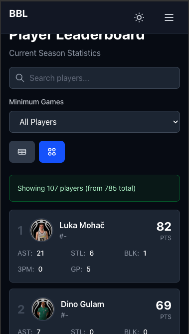

# Business Basketball League Platform

A modern, high-performance web platform for the Business Basketball League (BBL), featuring real-time statistics, player leaderboards, league standings, and comprehensive team management.

[](https://www.typescriptlang.org/)
[](https://reactjs.org/)
[](https://tanstack.com/start)
[](https://tailwindcss.com/)

---

## 📸 Screenshot


_Player Leaderboard with search, filtering, and comprehensive statistics in dark mode_

---

## ✨ Key Features

### 🏀 Core Features

- **Real-time Statistics** - Live player stats, team standings, and match results
- **Player Leaderboards** - Sortable statistics including points, assists, steals, blocks, and 3-pointers
- **League Standings** - Complete standings with win percentages, point differentials, and form indicators
- **Team Management** - Comprehensive team profiles and rosters
- **Match Schedule** - Upcoming games and historical results

### 🎨 User Experience

- **Dark Mode Support** - Fully implemented dark theme with system preference detection
- **Responsive Design** - Mobile-first design with adaptive layouts (table/card views)
- **Server-Side Rendering** - Fast initial page loads with TanStack Start
- **Data Caching** - Intelligent caching strategy with stale-while-revalidate
- **Loading States** - Skeleton screens and loading indicators for better UX
- **Error Handling** - Graceful error states with retry functionality

### ⚡ Performance

- **SSR & Streaming** - Server-side rendering for optimal performance
- **Route Code Splitting** - Automatic code splitting per route
- **Optimized Images** - Responsive images with proper sizing
- **Type Safety** - Full TypeScript coverage for reliability

---

## 🛠 Tech Stack

### Frontend

- **[React 19](https://react.dev/)** - Latest React with modern hooks and concurrent features
- **[TanStack Start](https://tanstack.com/start)** - Full-stack React framework with SSR
- **[TanStack Router](https://tanstack.com/router)** - Type-safe routing with file-based structure
- **[TanStack Query](https://tanstack.com/query)** - Powerful data fetching and caching
- **[TypeScript](https://www.typescriptlang.org/)** - Type safety and developer experience
- **[Tailwind CSS 4](https://tailwindcss.com/)** - Utility-first CSS framework
- **[Zod](https://zod.dev/)** - Schema validation and type inference

### Backend Integration

- **WordPress REST API** - SportsPress WordPress plugin integration
- **Custom API Client** - Type-safe API wrapper with error handling

### Build Tools

- **[Vite](https://vitejs.dev/)** - Next-generation frontend tooling
- **[TSConfig Paths](https://github.com/dividab/tsconfig-paths)** - Path alias resolution

---

## 📋 Prerequisites

Before you begin, ensure you have the following installed:

- **Node.js** 18.0 or higher
- **pnpm** 8.0 or higher (recommended) or npm/yarn

---

## 🚀 Getting Started

### Installation

1. **Clone the repository**

   ```bash
   git clone https://github.com/yourusername/bbl-platform.git
   cd bbl-platform
   ```

2. **Install dependencies**

   ```bash
   pnpm install
   # or
   npm install
   ```

3. **Configure API endpoint** (if needed)

   The API endpoint is configured in `src/lib/api/client.ts`:

   ```typescript
   const API_BASE_URL = "https://bbl.hr/wp-json/sportspress/v2";
   ```

4. **Start development server**

   ```bash
   pnpm dev
   ```

   The application will be available at `http://localhost:3000`

---

## 📁 Project Structure

```
bbl-v2/
├── src/
│   ├── components/
│   │   ├── features/        # Feature-specific components
│   │   │   ├── FormIndicator.tsx
│   │   │   ├── LeagueTable.tsx
│   │   │   └── PlayerLeaderboard.tsx
│   │   └── ui/              # Reusable UI components
│   │       ├── APIError.tsx
│   │       ├── NoData.tsx
│   │       └── StandingsTableSkeleton.tsx
│   ├── lib/
│   │   ├── api/             # API client and endpoints
│   │   │   ├── client.ts    # Base API client
│   │   │   ├── players.ts   # Player endpoints
│   │   │   └── standings.ts # Standings endpoints
│   │   ├── hooks/           # Custom React hooks
│   │   ├── types/           # TypeScript type definitions
│   │   └── utils/           # Utility functions
│   ├── routes/              # File-based routing
│   │   ├── __root.tsx       # Root layout
│   │   ├── index.tsx        # Homepage
│   │   ├── standings.tsx    # Standings page
│   │   ├── players.tsx      # Players leaderboard
│   │   ├── players.$playerId.tsx  # Individual player page
│   │   ├── schedule.tsx     # Match schedule
│   │   └── teams.tsx        # Teams overview
│   ├── app.css              # Global styles
│   └── routeTree.gen.ts     # Auto-generated route tree
├── public/                  # Static assets
├── .output/                 # Production build output
├── vite.config.ts           # Vite configuration
├── tsconfig.json            # TypeScript configuration
└── package.json             # Project dependencies
```

---

## 🔌 API Integration

The application integrates with the **SportsPress WordPress REST API** at `bbl.hr`:

### Available Endpoints

- **Players**
  - `GET /players` - List all players with statistics
  - `GET /players/:id` - Get individual player details
  - Query params: `league`, `season`, `team`, `per_page`, `page`, `search`, `_embed`

- **Standings**
  - `GET /tables` - Get league standings tables
  - Query params: `league`, `season`, `_embed`

- **Teams**
  - `GET /teams` - List all teams
  - `GET /teams/:id` - Get team details

### API Client Features

- Type-safe requests with TypeScript
- Automatic error handling with custom `APIError` class
- Query parameter serialization
- Response validation with Zod schemas
- Built-in retry logic via TanStack Query

### Example Usage

```typescript
import { getPlayers } from "~/lib/api/players";

// Fetch players for a specific league and season
const players = await getPlayers({
  league: 69,
  season: 239,
  per_page: 100,
  _embed: true,
});
```

---

## 📜 Available Scripts

```bash
# Development
pnpm dev          # Start dev server on localhost:3000

# Building
pnpm build        # Build for production
pnpm preview      # Preview production build locally

# Production
pnpm start        # Start production server

# Type Checking
tsc --noEmit      # Run TypeScript compiler (part of build)
```

---

## 🎯 Key Features Breakdown

### Player Leaderboard

- Dynamic sorting by any statistical category (PTS, AST, STL, BLK, 3PM)
- Player avatars with fallback initials
- Responsive table and card views
- Links to individual player detail pages
- Real-time statistics from WordPress API

### League Standings

- Complete standings with W-L records and win percentages
- Games behind calculation
- Points for/against and differential
- Last 5 games form indicator with visual badges
- Switchable table/card views for mobile
- Real-time updates from API

### Responsive Design

- Mobile-first approach
- Breakpoint-aware components
- Touch-friendly interactions
- Optimized for all screen sizes (mobile, tablet, desktop)

### Dark Mode

- System preference detection
- Persistent user preference
- Smooth transitions between themes
- Full coverage across all components

---

## 🏗 Development

### Adding New Routes

TanStack Start uses file-based routing. Create a new file in `src/routes/`:

```typescript
// src/routes/new-page.tsx
import { createFileRoute } from '@tanstack/react-router'

export const Route = createFileRoute('/new-page')({
  component: NewPage,
})

function NewPage() {
  return <div>New Page Content</div>
}
```

### Adding New API Endpoints

1. Define types in `src/lib/types/`
2. Create endpoint functions in `src/lib/api/`
3. Use TanStack Query hooks for data fetching

```typescript
// src/lib/api/matches.ts
export async function getMatches() {
  return apiClient.get<Match[]>("/matches", { _embed: true });
}

// In your component
import { useQuery } from "@tanstack/react-query";

const { data: matches } = useQuery({
  queryKey: ["matches"],
  queryFn: getMatches,
  staleTime: 5 * 60 * 1000, // 5 minutes
});
```

### Styling Guidelines

- Use Tailwind utility classes
- Follow the existing dark mode pattern: `dark:bg-gray-800`
- Use the `touch-target` class for interactive elements
- Maintain responsive breakpoints: `md:`, `lg:`

---

### Code Standards

- Write type-safe TypeScript
- Follow existing code style and conventions
- Add comments for complex logic
- Test your changes thoroughly
- Ensure responsive design works on all breakpoints

---

## 📄 License

This project is licensed under the MIT License - see the [LICENSE](LICENSE) file for details.

---

## 🙏 Acknowledgments

- **[TanStack](https://tanstack.com/)** for the incredible suite of tools
- **[SportsPress](https://wordpress.org/plugins/sportspress/)** for the WordPress plugin
- **[Tailwind CSS](https://tailwindcss.com/)** for the utility-first CSS framework

---

## 📧 Contact

For questions or support, please open an issue on GitHub or contact the development team.

---

**Built with ❤️ for the Business Basketball League**
